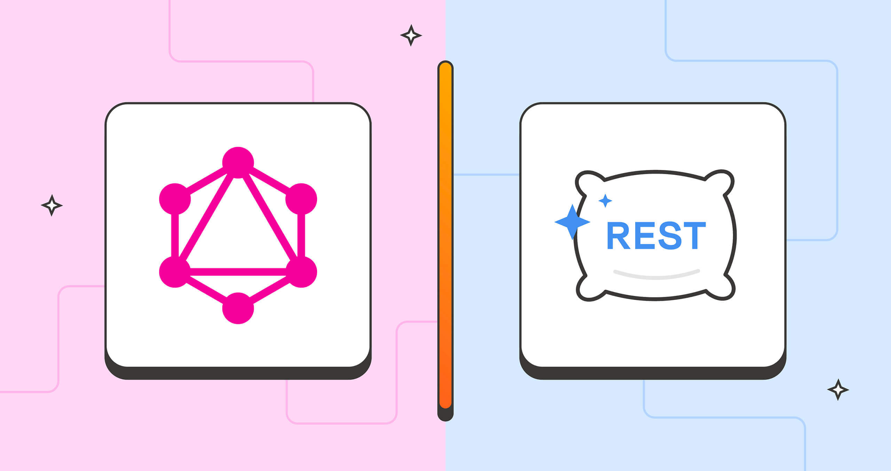

# ***Roadmap of Wisdom aka MScience***

## **Foundation**
- CSS,HTML
- Javascript
  - Javascript Basic
  - Javascript Advanced
- Typescript
## **Font-End**

### Skill
- ReactJS
  - ReactJS Basic 
  - ReactJS Class Component 
  - ReactJS Function Component (hook)
  - Redux 
- NextJS 
  - NextJS Basic
  - NextJS Advanced
  - NextJS SEO (Search Engine Optimization)

## **Back-End**

### Skill
- NodeJS (Express)
   - Express Foundation
   - Express Practises
- NestJS
  - NestJS Basic
  - NestJS Advanced
## **Styles**

- SASS
- Tailwind
- Bootstrap 5

## **DATABASE**

- SQL
  - MySQL
  - PostgreSQL
- NoSQL
  - MongoDB

## **API**

- Restful
- GraphQL

## **Other**

- Git, Github

- Docker

- Jest

### Contact me 
- phone : 0787998419
- facebook : [Phạm Minh Khoa](https://www.facebook.com/people/Ph%E1%BA%A1m-Minh-Khoa/pfbid0SxZamt5AHa7NmLuYhNn5WRA9KuLSXQZDft4j9YfhCKspjdyzLco5wPV5noCd3wpRl/)
